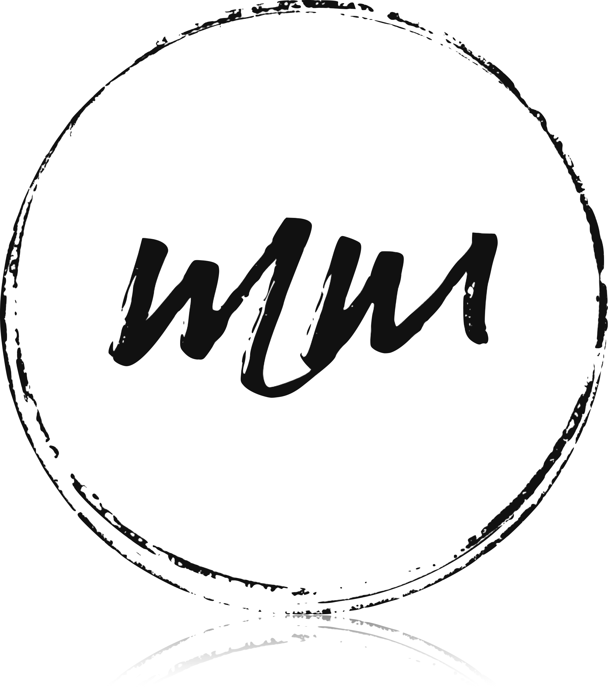

---
#
# By default, content added below the "---" mark will appear in the home page
# between the top bar and the list of recent posts.
# To change the home page layout, edit the _layouts/home.html file.
# See: https://jekyllrb.com/docs/themes/#overriding-theme-defaults
#
layout: page
key: marijke
---

<section class="intro">

  

  <h1>Relaxatietherapie Marijke Michiels</h1>

  
Je kan bij mij terecht voor behandelingen als ondersteuning bij
     algemene vermoeidhied, spierspanningen, hoofd- en aangezichtspijnen,
     hyperventilatie of burn-out.

  

    Ik organiseer ook <a href="/workshops/">workshops</a> <a href="/workshops/">'omgaan met stress'</a>.
  

</section>

<section class="behandelingen">
<h1>Behandelingen</h1>

<table>
  <tr>
    <td>Relaxerende rugmassage</td>
    <td class="align-left">30min</td>
    <td class="align-right">45€</td>
  </tr>
  <tr>
    <td>Anti-stress Nek-Schouders-Hoofd</td>
    <td class="align-left">30min</td>
    <td class="align-right">45€</td>
  </tr>
  <tr>
    <td>Progressieve relaxatie en ademhaling</td>
    <td class="align-left">30min</td>
    <td class="align-right">45€</td>
  </tr>
  <tr>
    <td>Relaxerende lichaamsmassage</td>
    <td class="align-left">1u</td>
    <td class="align-right">75€</td>
  </tr>
  <tr>
    <td>Lichaamsmassage Aromatherapie</td>
    <td class="align-left">1u</td>
    <td class="align-right">85€</td>
  </tr>
  <tr>
    <td></td>
    <td class="align-left">1u30</td>
    <td class="align-right">115€</td>
  </tr>
</table>

  Zin om samen met je geliefde, vriend(in) of wie je aan het hart ligt, samen een duo-massage te boeken ? Dit kan op maandag- en vrijdagnamiddag. Reserveer tijdig !

</section>

<section class="cadeaubon">
<h1>Cadeaubon</h1>

Een prachtig en deugddoend geschenk voor ieder van ons.
   Even buiten bereik zijn … om tijd te maken voor jezelf.

Een cadeaubon kan afgehaald worden in mijn praktijk of opgestuurd worden.
   Bel me gerust op <a href="tel:+32 468 45 67 21">0468 45 67 21</a>
   of neem contact op via <a class="whatsapp" href="https://wa.me/{{ site.footer.whatsapp }}">WhatsApp</a>.

<section class="wellnessarrangement">
<h1>Wellnessarrangement in Zottegem 2p.</h1>

Ontsnap aan de dagelijkse sleur en trakteer jezelf op een verkwikkend wellnessweekend in het hart van Zottegem, de poort naar de Vlaamse Ardennen. 

<strong>Wat?</strong> Een exclusief wellnessarrangement voor twee personen.

<strong>Wanneer?</strong> Van vrijdag 16u tot zondag 15u.

<strong>Locatie?</strong> Gelegen in Zottegem, een ideale startplaats voor wandel- en fietstochten in de schilderachtige Vlaamse Ardennen.

<a href="arrangement">Meer info</a>

</section>

<section class="workshops">
<h1>Workshops</h1>

  Er is ook een aanbod <a href="workshops">workshops</a> <a href="workshops">'omgaan met stress'</a> waar we eerst stress beter
  leren begrijpen en vervolgens massage, ademhaling en stretching,
  relaxatie en zintuigelijk waarneming, zowel theoretisch als praktisch aanpakken.

Deze worden enkel georganiseerd op aanvraag.

<!--

Het stress-release traject bestaat uit 1 <a href="workshops#basis">basis opleiding</a>
   en 4 praktijkgerichte <a href="workshops#workshops">workshops</a>.
   Deze gaan door in kleine groepjes van maximaal 4 personen.
 

<table>
  <tr>
    <td><a href="workshops#basis">Stress begrijpen (basis opleiding)</a></td>
    <td class="align-left">2.5u</td>
    <td class="align-right">75€/persoon</td>
  </tr>
  <tr>
    <td><a href="workshops#massage">Massagetechnieken Nek, Schouders Hoofd</a></td>
    <td class="align-left">6u</td>
    <td class="align-right">245€/persoon</td>
  </tr>
  <tr>
    <td><a href="workshops#ademhaling">Ademhaling, Hartcoherentie en Stretching</a></td>
    <td class="align-left">3u</td>
    <td class="align-right">125€/persoon</td>
  </tr>
  <tr>
    <td><a href="workshops#relaxatie">Relaxatie, Visuaslisatie en Zintuigelijke waarneming</a></td>
    <td class="align-left">3u</td>
    <td class="align-right">125€/persoon</td>
  </tr>
</table>
 -->
</section>

